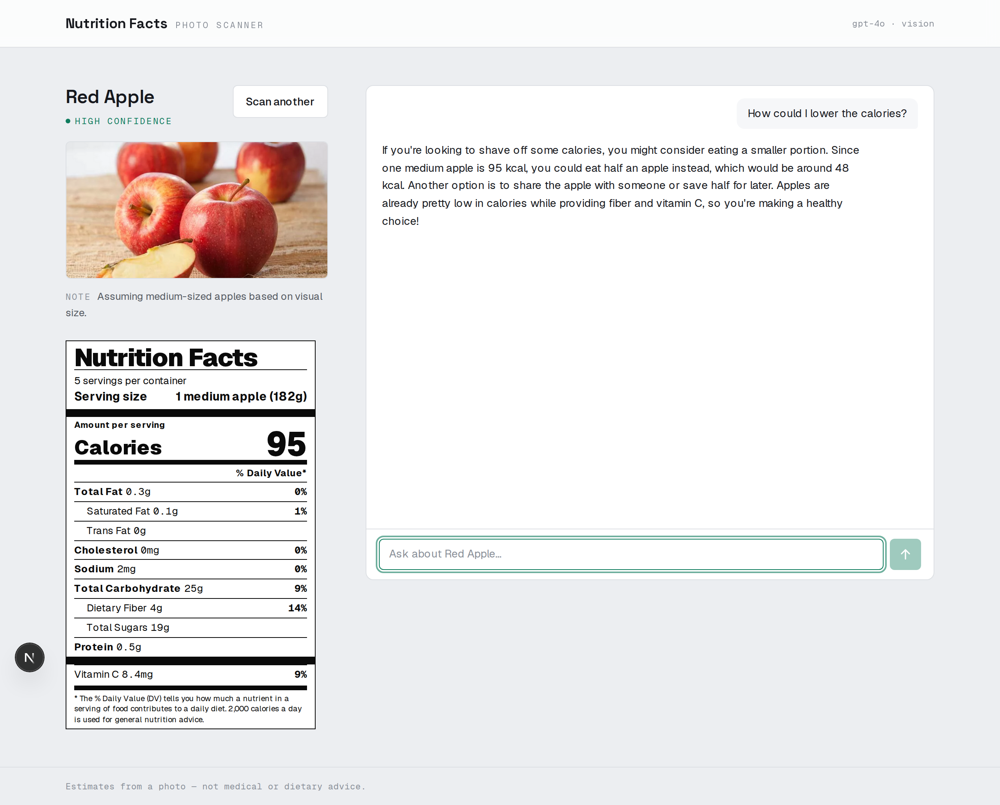

# Nutrition Facts — food photo scanner

Upload a food photo → get an FDA-style **Nutrition Facts** label estimated by
GPT-4o vision → talk through the food in a streaming chat that always knows what
it's looking at.



```
photo → GPT-4o (vision) → nutrition JSON → FDA label
                                        ↘ streaming chat ← suggested chips
```

## What it does

- **Drop, browse, or paste** a food photo (or tap a bundled sample).
- **One GPT-4o vision call** returns a strict nutrition JSON shape.
- **An authentic FDA Nutrition Facts label**, rendered in CSS from that JSON —
  heavy rules, bold/regular hierarchy, mono numerals, a computed %DV column.
- **A streaming chat** with the food's numbers pinned in the system prompt, so
  the conversation stays grounded. Replies render token-by-token.
- **Three suggested follow-ups** to start the conversation in one tap.

## Stack

- **Next.js 16 (App Router)** + React 19 + TypeScript — one app, API routes
  handle the model calls, no separate backend.
- **OpenAI SDK (GPT-4o)** for vision (structured JSON) and chat (streamed).
- **Tailwind v4** — design tokens live in `app/globals.css`.

## Setup

Requires Node 20+ and an OpenAI API key. Run inside the WSL/Linux filesystem
(not `/mnt/c`) so file-watching stays fast.

```bash
npm install
```

### API key

This app lives inside `secondtalent/`, and the real key lives in the shared
parent env at `secondtalent/.env` (`OPENAI_API_KEY=...`). Next.js only auto-loads
`.env*` from its own root, so copy the key into a gitignored `.env.local`:

```bash
grep '^OPENAI_API_KEY=' ../.env > .env.local
```

Only `.env.example` is committed; every real `.env*` is gitignored.

## Run

```bash
npm run dev      # http://localhost:3000
npm run build    # production build
npm start        # serve the build
npm run shot     # screenshot the real upload→analyze flow (visual check; needs dev running)
```

## Samples

`samples/` holds test photos, also mirrored into `public/samples/` so the
on-screen picker can serve them: `apple.png`, `avocado.png`, `banana.png`.

> Note: these are three clear single-food shots. The brief also suggests a
> **mixed-plate** photo — drop one into both `samples/` and `public/samples/`
> and add it to the `SAMPLES` list in `app/page.tsx` to surface it in the picker.
> (The model already handles multi-item plates — the apple shot, for instance,
> comes back with several servings per container.)

## Project layout

```
app/
  page.tsx              # client orchestration: upload → label → chat
  layout.tsx            # fonts (Space Grotesk / Geist / Geist Mono) + metadata
  globals.css           # design tokens — the single source of truth
  icon.svg              # favicon
  api/
    analyze/route.ts    # GPT-4o vision → strict nutrition JSON (+ normalizer)
    chat/route.ts       # streamed chat, food pinned in the system prompt
components/
  UploadPanel.tsx       # drag-drop / paste / preview / validation
  NutritionLabel.tsx    # the FDA label
  Chat.tsx              # streaming chat + suggested chips
  ConfidenceBadge.tsx
  ui/Button.tsx
lib/types.ts            # the nutrition JSON contract
scripts/shot.mjs        # Playwright visual-check utility
samples/                # test food photos
```

## Design

Clinical "FDA paper" direction, not the default AI look: a cool off-white canvas,
near-black ink, **one** spruce-green accent, and three type roles — a
characterful display face for the food name, a clean grotesque for body and the
label, and a mono for the numbers. The label is the loud thing; everything else
stays quiet. Tokens are defined once in `app/globals.css`.

> Estimates from a photo — not medical or dietary advice.
