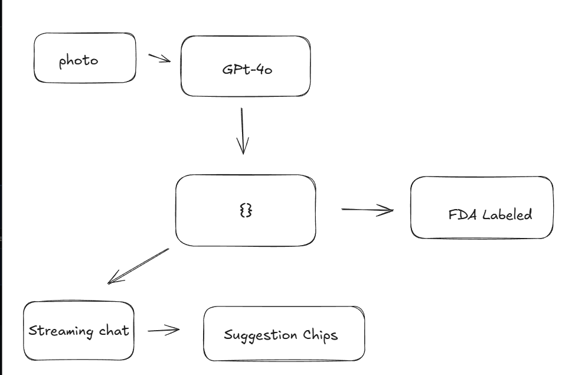

# Nutrition Facts — food photo scanner

Upload a food photo → get an FDA-style **Nutrition Facts** label estimated by
GPT-4o vision → talk through the food in a streaming chat that always knows what
it's looking at.



```
photo → GPT-4o (vision) → nutrition JSON → FDA label
                                        ↘ streaming chat ← suggested chips
```

## Stack

- **Next.js 16 (App Router)** + React 19 + TypeScript — one app, API routes handle
  the model calls, no separate backend.
- **OpenAI SDK (GPT-4o)** for vision (structured JSON) and chat (streamed).
- **Tailwind v4** — design tokens live in `app/globals.css`.

## Setup

Requires Node 20+ and an OpenAI API key. Run inside the WSL/Linux filesystem
(not `/mnt/c`) so file-watching stays fast.

```bash
npm install
```

### API key

This app lives inside `secondtalent/`, and the real key lives in the shared
parent env at `secondtalent/.env` (`OPENAI_API_KEY=...`). Next.js only auto-loads
`.env*` from its own root, so copy the key into a gitignored `.env.local`:

```bash
grep '^OPENAI_API_KEY=' ../.env > .env.local
```

Only `.env.example` is committed; every real `.env*` is gitignored.

## Run

```bash
npm run dev      # http://localhost:3000
npm run build    # production build
npm start        # serve the build
```

## Project layout

```
app/
  page.tsx          # client orchestration: upload → label → chat
  layout.tsx        # fonts (Space Grotesk / Geist / Geist Mono) + metadata
  globals.css       # design tokens (the single source of truth)
  api/
    analyze/        # GPT-4o vision → nutrition JSON   (checkpoint 2)
    chat/           # streamed chat with food in context (checkpoint 4)
components/
  UploadPanel.tsx   # drag-drop / paste / preview / validation
  ui/Button.tsx
lib/types.ts        # the nutrition JSON contract
samples/            # test food photos
```

> Estimates from a photo — not medical or dietary advice.
